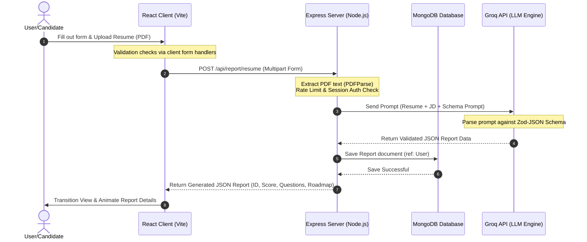

# 🎯 GenAI.prep — AI-Powered Interview Preparation Platform

[](https://nodejs.org/)
[](https://react.dev/)
[](https://tailwindcss.com/)
[](https://opensource.org/licenses/ISC)
[](https://www.mongodb.com/)
[](https://groq.com/)

**GenAI.prep** is a premium, end-to-end web application designed to help candidates conquer technical and behavioral interviews. By aligning a user's resume, targeted job description, and optional personal background details, the platform leverages state-of-the-art Generative AI to generate matching scores, custom interview questions, action-oriented skill gap analyses, and dynamic day-by-day preparation roadmaps.

---

## 📖 Table of Contents

1. [Key Features](#-key-features)
2. [System Architecture](#-system-architecture)
3. [Technology Stack](#-technology-stack)
4. [Project Directory Layout](#-project-directory-layout)
5. [API Reference](#-api-reference)
6. [Database Schema Designs](#-database-schema-designs)
7. [Installation & Local Setup](#-installation--local-setup)
8. [Environment Variable Configuration](#-environment-variable-configuration)
9. [Running Automated Tests](#-running-automated-tests)
10. [Security & Design Considerations](#-security--design-considerations)

---

## ✨ Key Features

*   **📄 PDF Resume Parsing:** Automated text extraction from uploaded PDF resumes using a robust in-memory parsing pipeline.
*   **🎯 Role Matching & Alignment Score:** Evaluates your profile compatibility against target job descriptions and yields a precise match percentage.
*   **💡 AI-Generated Interview Questions:** Generates specialized technical and behavioral question sets complete with the recruiter's behind-the-scenes intention and recommended sample answers.
*   **🚧 Skill Gap Diagnostics:** Identifies high, medium, and low severity discrepancies between your resume and target job requirements, complete with constructive advice.
*   **📅 Daily Preparation Roadmaps:** Formulates a structured, day-by-day study schedule with concrete tasks to help bridge identified skill gaps.
*   **🔒 Secure Cookie-Based JWT Auth:** Session handling utilizing secure, `HttpOnly`, `SameSite=Strict` cookies.
*   **🚫 Active Token Blacklisting:** Supports full logout token revocation with automatic database-level TTL indices for self-cleaning token expiry.
*   **🛡️ Production-Grade Security:** Out-of-the-box integration with `helmet` for HTTP headers, `compression` for responses, and customized `express-rate-limit` rule sets.

---

## 🏗️ System Architecture

The following diagram illustrates the flow of requests and data transfer through the platform:



---

## 💻 Technology Stack

### Frontend Core
*   **React 19 & Vite:** Next-generation framework features and lightning-fast Hot Module Replacement (HMR).
*   **Tailwind CSS v4.0:** Advanced, utility-first CSS engine mapping modern designs using theme tokens and variables.
*   **Framer Motion:** Custom page transitions, physics-based springs, and elegant tab underlines.
*   **Axios:** Configured API instance utilizing global interceptors and `withCredentials` settings.
*   **Sonner:** Lightweight, toast notifications for seamless user feedback.

### Backend Core
*   **Node.js & Express (ESM):** Fast, asynchronous API routing using ES Modules.
*   **Mongoose & MongoDB:** Document database modeling with custom middleware hooks.
*   **Groq SDK:** High-throughput inference platform invoking the `openai/gpt-oss-120b` engine.
*   **Zod & Zod-to-JSON-Schema:** Strict validation schemas mapped directly to LLM structured output instructions.
*   **Multer:** Configured to handle fast, memory-buffer uploads for PDF processing.
*   **Pino & Pino-HTTP:** Ultra-low overhead, structured JSON logger with redacted sensitive headers.

---

## 📂 Project Directory Layout

```text
genAI/
├── backend/                      # Node.js + Express backend service
│   ├── src/
│   │   ├── config/               # Database, Env, and Logger configurations
│   │   ├── controllers/          # Request handlers (auth, interview reports)
│   │   ├── middleware/           # Auth validation, rate limiters, file uploads, errors
│   │   ├── models/               # MongoDB Mongoose collection schemas
│   │   ├── routes/               # API route definitions
│   │   ├── services/             # Groq SDK API call orchestration
│   │   ├── utils/                # Helper utilities (JWT generation, etc.)
│   │   └── validators/           # Zod schemas for input validation
│   ├── server.js                 # API entry point
│   ├── vitest.config.js          # Backend test environment settings
│   └── vitest.setup.js           # MongoMemoryServer lifecycle setup
├── frontend/                     # React + Vite client app
│   ├── src/
│   │   ├── components/           # Generic / Global reusable UI components
│   │   ├── features/
│   │   │   ├── auth/             # Login, signup components, context & hooks
│   │   │   └── interview/        # Report views, roadmap lists, and submission forms
│   │   ├── lib/                  # Theme styling helper tools
│   │   ├── App.jsx               # Main React entry page
│   │   ├── appRoutes.jsx         # React Router v7 configuration
│   │   ├── index.css             # Tailwind v4 import & Custom Theme scoping
│   │   └── main.jsx              # React DOM mounting
│   ├── index.html                # App wrapper template
│   └── vite.config.js            # Build configuration settings
```

---

## 🔌 API Reference

### 🔐 Authentication Endpoints (`/api/auth`)

| Method | Endpoint | Access | Description | Request Body / Payload |
| :--- | :--- | :--- | :--- | :--- |
| **POST** | `/register` | Public | Registers a new user account and registers cookie. | `{ username, email, password, confirmPassword }` |
| **POST** | `/login` | Public | Authenticates credentials and issues JWT token. | `{ email, password }` |
| **POST** | `/logout` | Private | Logs user out and blacklists active session token. | *None (Extracts token from cookies)* |
| **GET** | `/profile` | Private | Retrieves current authenticated profile details. | *None* |

### 📋 Interview Prep & Reports (`/api/report`)

| Method | Endpoint | Access | Description | Request Body / Payload |
| :--- | :--- | :--- | :--- | :--- |
| **POST** | `/resume` | Private | Uploads PDF resume and generates interview report. | `FormData`: `resume` (PDF file), `jobDescription` (string), `selfDescription` (string, optional) |
| **GET** | `/:id` | Private | Retrieves a specific interview preparation report by ID. | *None* |
| **GET** | `/` | Private | Lists all reports generated by the user (paginated). | *Query parameters*: `page` (default: 1), `limit` (default: 10) |

---

## 🗄️ Database Schema Designs

### User Model (`users`)
Stores core candidate credentials. Encrypts passwords automatically using a pre-save hook with `bcrypt`.
```javascript
{
  username: { type: String, unique: true, required: true },
  email: { type: String, unique: true, required: true },
  password: { type: String, required: true }
}
```

### Blacklisted Token Model (`blacklistTokens`)
Used to invalidate tokens on user logout. Leverages MongoDB's native Time-To-Live (TTL) index to clean up expired entries automatically.
```javascript
{
  token: { type: String, unique: true, required: true },
  expiresAt: { type: Date, required: true, index: { expires: 0 } }
}
```

### Interview Report Model (`InterviewReport`)
Saves generated analysis data associated with a specific user profile.
```javascript
{
  jobDescription: { type: String, required: true },
  resume: { type: String },
  selfDescription: { type: String },
  matchScore: { type: Number, min: 0, max: 100 },
  jobTitle: { type: String, required: true },
  user: { type: mongoose.Schema.Types.ObjectId, ref: 'users' },
  technicalQuestions: [{
    question: String, intention: String, answer: String
  }],
  behavioralQuestions: [{
    question: String, intention: String, answer: String
  }],
  skillGaps: [{
    skill: String, severity: String, description: String
  }],
  preparationPlan: [{
    day: String, focus: String, tasks: [String]
  }]
}
```

---

## ⚙️ Environment Variable Configuration

Create a `.env` file in the `backend/` directory using the structure shown below:

```ini
# Server Setup
PORT=3000
NODE_ENV=development
FRONTEND_URL=http://localhost:5173

# Database Connections
MONGO_URI=mongodb://localhost:27017/genai

# Security Secrets
JWT_SECRET=replace_with_a_long_random_string_here

# AI Orchestrator Key
GROQ_API_KEY=your_groq_api_key_here
```

---

## 🚀 Installation & Local Setup

### Prerequisites
*   **Node.js** (v18.0.0 or higher recommended)
*   **npm** (or yarn)
*   **MongoDB** (running instance, or substitute connection string)

### 1. Clone the repository and install dependencies
```bash
# Clone the repository
git clone https://github.com/yourusername/genAI.git
cd genAI

# Install backend dependencies
cd backend
npm install

# Install frontend dependencies
cd ../frontend
npm install
```

### 2. Configure environments
Rename `.env.example` in the `backend` folder to `.env` and fill in your credential values (like `GROQ_API_KEY` and `JWT_SECRET`).

### 3. Launch Services

#### Start the Backend API
```bash
cd backend
npm run dev # Starts express server on port 3000 (via nodemon)
```

#### Start the Frontend Client
```bash
cd frontend
npm run dev # Starts Vite server on port 5173
```

Now, navigate to `http://localhost:5173` in your browser.

---

## 🧪 Running Automated Tests

The backend project includes unit and integration tests using **Vitest**. The suite uses **MongoDB Memory Server** (`mongodb-memory-server`) to spin up a sandboxed, ephemeral database instance. This guarantees that your tests execute quickly and without polluting your local database.

To execute tests, run the following command in the `backend` directory:
```bash
cd backend
npm run test
```

---

## 🛡️ Security & Design Considerations

*   **Cookie Security:** JWTs are delivered inside standard HTTP header payloads and saved as `HttpOnly`, `SameSite=Strict`, and `Secure` (in production) cookies, mitigating Cross-Site Scripting (XSS) and Cross-Site Request Forgery (CSRF) attack routes.
*   **Token Expiry & Cleanup:** When a user logs out, their JWT is entered into the `blacklistTokens` collection. A MongoDB TTL index monitors the `expiresAt` timestamps and automatically drops records, preventing database bloat.
*   **Express Security Headers:** Integrates `helmet` middleware to enforce secure HTTP headers (e.g., preventing clickjacking).
*   **Payload Limitations:** Middleware enforces rigid size caps on incoming requests (e.g., `1mb` JSON payloads, `3MB` PDF files) to stave off Denial-of-Service (DoS) vectors.
*   **Zod Parsing & Type Safety:** Input payloads are dynamically scrubbed and verified against strict schemas before controllers handle routing, preventing injections or malformed inputs.
*   **Dynamic Theme Scoping:** Themes are dynamically scoped using CSS custom properties (via `.theme-interview`). This keeps login/register pages styled clean and minimally, while the interview dashboard leverages a warm, dark, editorial theme.
